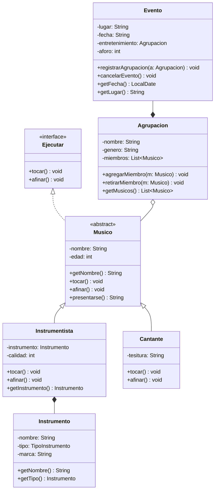
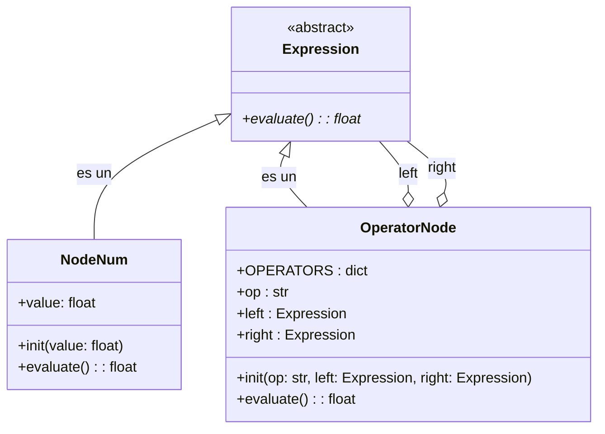

# Proyectos Modelos de Programación

Participantes grupo:
- Juan David Buitrago - 20242020194
- Andrés Felipe Preciado Castilla - 20241020158

## 1. Modelado De Grupo Musical

## 2. Composite - Árbol de Operaciones

